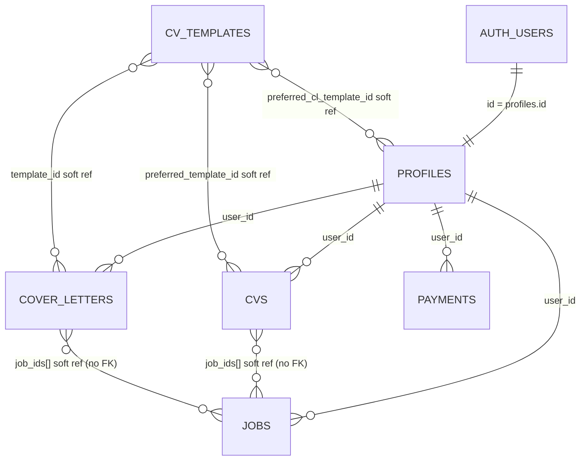

# Database schema and relationships

**Database:** PostgreSQL (Supabase)  
**Source of truth:** `supabase/migrations/*.sql` (migrations `001`–`011`)  
**Last aligned with migrations:** 2026-04-04  

This document describes all relational tables, storage buckets, and how they connect. Soft references (string IDs or UUID arrays with no foreign key to `jobs`) are called out explicitly.

---

## Table index

| Table | Purpose |
|--------|---------|
| `auth.users` | Supabase Auth identities (managed by Supabase, not application migrations) |
| `profiles` | App user row: email, subscription, onboarding — FK parent for user-owned data |
| `cvs` | All CV documents (general and job-tailored); `job_ids = '{}'` means master/general CV |
| `jobs` | Job tracker (Kanban) — single source of truth for company, title, description |
| `cover_letters` | Generated cover letters; job context via `job_ids`, not duplicated columns |
| `payments` | Payment / billing records |
| `cv_templates` | Seed catalog of CV and cover letter templates |

**Storage (not SQL tables):** `cv-uploads`, `pdf-exports`, `cv-photos` — see [Storage buckets](#storage-buckets-supabase-storage).

---

## Relationship overview

### Foreign keys (enforced)

| Child table | Column | Parent | On delete |
|-------------|--------|--------|-----------|
| `profiles` | `id` | `auth.users(id)` | CASCADE |
| `cvs` | `user_id` | `profiles(id)` | CASCADE |
| `jobs` | `user_id` | `profiles(id)` | CASCADE |
| `cover_letters` | `user_id` | `profiles(id)` | CASCADE |
| `payments` | `user_id` | `profiles(id)` | CASCADE |

### Soft references (no FK)

| Location | Column | Target |
|----------|--------|--------|
| `cvs` | `job_ids` (UUID[]) | Rows in `jobs` — query with `job_ids @> ARRAY['uuid']` |
| `cover_letters` | `job_ids` (UUID[]) | Rows in `jobs` |
| `cvs` | `preferred_template_id` | `cv_templates.id` (TEXT) |
| `cover_letters` | `template_id` | `cv_templates.id` |
| `profiles` | `preferred_cl_template_id` | `cv_templates.id` (TEXT) — see `001_schema.sql` |

---

## `auth.users` (Supabase Auth)

Not created by app migrations. `profiles.id` is the same UUID as `auth.users.id`. RLS and triggers in `001_schema.sql` create a `profiles` row on signup via `handle_new_user()`.

---

## `profiles`

Extends the auth user with subscription and app settings.

| Column | Type | Notes |
|--------|------|--------|
| `id` | UUID | PK, FK → `auth.users(id)` ON DELETE CASCADE |
| `email` | TEXT | NOT NULL, UNIQUE |
| `full_name` | TEXT | |
| `avatar_url` | TEXT | |
| `subscription_tier` | TEXT | NOT NULL DEFAULT `'free'` — `free`, `pro`, `premium`, `career` |
| `subscription_status` | TEXT | NOT NULL DEFAULT `'inactive'` |
| `subscription_expires_at` | TIMESTAMPTZ | |
| `trial_ends_at` | TIMESTAMPTZ | |
| `is_onboarded` | BOOLEAN | NOT NULL DEFAULT false |
| `preferred_cl_template_id` | TEXT | DEFAULT `'cl-classic'` — soft ref to `cv_templates` (`001_schema.sql`; `011` uses `ADD COLUMN IF NOT EXISTS` for idempotency) |
| `created_at` | TIMESTAMPTZ | NOT NULL DEFAULT NOW() |
| `updated_at` | TIMESTAMPTZ | NOT NULL DEFAULT NOW() |

**Cardinality:** One row per authenticated user.

---

## `cvs`

Unified CV storage: general (master) CVs and job-tailored CVs. **`job_ids = '{}'`** means a general CV; **non-empty `job_ids`** links the row to one or more `jobs` entries (soft reference).

| Column | Type | Notes |
|--------|------|--------|
| `id` | UUID | PK |
| `user_id` | UUID | NOT NULL FK → `profiles(id)` |
| `name` | TEXT | NOT NULL DEFAULT `'Untitled CV'` |
| `full_name` … `summary` | TEXT | |
| `address`, `photo_url` | TEXT | |
| `linkedin_url`, `github_url` | TEXT | |
| `links` | JSONB | NOT NULL DEFAULT `'[]'` |
| `experience` … `referrals` | JSONB | NOT NULL DEFAULT `'[]'` |
| `section_visibility` | JSONB | NOT NULL DEFAULT `'{}'` |
| `preferred_template_id` | TEXT | DEFAULT `'classic'` |
| `font_family` | TEXT | DEFAULT `'Inter'` |
| `accent_color` | TEXT | DEFAULT `'#6C63FF'` |
| `job_ids` | UUID[] | NOT NULL DEFAULT `'{}'` |
| `ai_changes_summary` | TEXT | |
| `keywords_added` | JSONB | NOT NULL DEFAULT `'[]'` |
| `bullets_improved` | INTEGER | DEFAULT 0 |
| `original_cv_file_url` | TEXT | |
| `is_complete` | BOOLEAN | NOT NULL DEFAULT FALSE |
| `completion_percentage` | INTEGER | NOT NULL DEFAULT 0 |
| `is_archived` | BOOLEAN | NOT NULL DEFAULT FALSE |
| `created_at` / `updated_at` | TIMESTAMPTZ | NOT NULL |

**Indexes (011):** `idx_cvs_user_id_created_at`, GIN on `job_ids`.

---

## `jobs`

Kanban / pipeline for applications. Company, title, and description live **only** here.

| Column | Type | Notes |
|--------|------|--------|
| `id` | UUID | PK |
| `user_id` | UUID | NOT NULL FK → `profiles(id)` |
| `company_name` | TEXT | NOT NULL |
| `job_title` | TEXT | NOT NULL |
| `job_url` | TEXT | |
| `job_description` | TEXT | |
| `location` | TEXT | |
| `salary_min` / `salary_max` | INTEGER | |
| `salary_currency` | TEXT | NOT NULL DEFAULT `'USD'` |
| `work_type` | TEXT | CHECK `remote` / `hybrid` / `onsite` |
| `status` | TEXT | NOT NULL DEFAULT `'saved'`, CHECK: `saved`, `applied`, `interviewing`, `offered`, `rejected`, `withdrawn` |
| `saved_at` / `applied_at` / `interview_at` / `offer_at` / `deadline` | TIMESTAMPTZ | |
| `notes` | TEXT | |
| `contact_name` / `contact_email` | TEXT | |
| `priority` | TEXT | NOT NULL DEFAULT `'medium'` |
| `is_starred` | BOOLEAN | NOT NULL DEFAULT FALSE |
| `created_at` / `updated_at` | TIMESTAMPTZ | NOT NULL |

**Indexes (011):** `idx_jobs_user_id`, `idx_jobs_status`.

---

## `cover_letters`

| Column | Type | Notes |
|--------|------|--------|
| `id` | UUID | PK |
| `user_id` | UUID | NOT NULL FK → `profiles(id)` |
| `name` | TEXT | NOT NULL DEFAULT `'Untitled Cover Letter'` |
| `tone` | TEXT | |
| `length` | TEXT | |
| `specific_emphasis` | TEXT | |
| `content` | TEXT | |
| `ats_score` | INTEGER | CHECK 0–100 |
| `ats_keywords_found` / `ats_keywords_missing` | JSONB | NOT NULL DEFAULT `'[]'` |
| `ats_summary` | TEXT | |
| `template_id` | TEXT | DEFAULT `'cl-classic'` |
| `pdf_url` / `docx_url` | TEXT | |
| `share_token` | TEXT | UNIQUE |
| `is_favourited` | BOOLEAN | NOT NULL DEFAULT FALSE |
| `generation_model` | TEXT | |
| `input_tokens` / `output_tokens` | INTEGER | |
| `job_ids` | UUID[] | NOT NULL DEFAULT `'{}'` — soft ref to `jobs` |
| `applicant_name` … `applicant_location` | TEXT | snapshot at generation |
| `created_at` / `updated_at` | TIMESTAMPTZ | NOT NULL |

**Indexes (011):** `idx_cover_letters_user_id`, GIN on `job_ids`.

---

## `payments`

| Column | Type | Notes |
|--------|------|--------|
| `id` | UUID | PK |
| `user_id` | UUID | NOT NULL FK → `profiles(id)` |
| `tran_id` | TEXT | NOT NULL, UNIQUE |
| `val_id` | TEXT | |
| `amount` | DECIMAL(10,2) | NOT NULL, CHECK > 0 |
| `currency` | TEXT | NOT NULL DEFAULT `'USD'` |
| `status` | TEXT | NOT NULL DEFAULT `'pending'`, CHECK enum |
| `plan` | TEXT | NOT NULL, CHECK enum (subscription plan ids) |
| `billing_period_start` / `billing_period_end` | TIMESTAMPTZ | |
| `gateway_response` | JSONB | |
| `created_at` / `updated_at` | TIMESTAMPTZ | NOT NULL |

---

## `cv_templates`

Seed catalog; readable by all authenticated users via RLS (`SELECT` allowed).

| Column | Type | Notes |
|--------|------|--------|
| `id` | TEXT | PK (e.g. `classic`, `cl-classic`, `apex`, `nova`) |
| `type` | TEXT | NOT NULL — `cv` or `cover_letter` |
| `name` | TEXT | NOT NULL |
| `description` | TEXT | |
| `preview_image_url` | TEXT | |
| `category` | TEXT | |
| `is_premium` | BOOLEAN | DEFAULT FALSE |
| `available_tiers` | TEXT[] | DEFAULT includes free/pro/premium/career |
| `sort_order` | INTEGER | DEFAULT 0 |

Initial rows are inserted in `001_schema.sql`; `apex` and `nova` are added in `006_cv_templates_apex_nova.sql`.

---

## Storage buckets (Supabase Storage)

These are not PostgreSQL tables; paths typically start with `{user_id}/...`.

| Bucket | Public | Purpose |
|--------|--------|---------|
| `cv-uploads` | No | Temporary CV file uploads (PDF/DOCX) |
| `pdf-exports` | No | Exported PDFs |
| `cv-photos` | Yes | Profile photos for CV (migration `003`) |

Policies: see `002_storage.sql` and `003_cv_profile_extra.sql`.

---

## Row Level Security (RLS)

Production policies should allow authenticated users to manage their own rows on `profiles`, `cvs`, `jobs`, `cover_letters`, `payments`, and read `cv_templates`. Earlier migrations (`001`–`010`) targeted legacy table names; after migration `011`, ensure policies exist for `cvs`, `jobs`, and the new `cover_letters` shape. `cover_letters` may include a `share_token` read policy for public sharing.

---

## Triggers

- `update_updated_at()` on: `profiles`, `payments`, and (per your deployed policies) `cvs`, `jobs`, `cover_letters`
- `on_auth_user_created` on `auth.users` → inserts into `profiles`

---

## Changelog (migrations summary)

| Migration | Change |
|-----------|--------|
| `001_schema.sql` | Base tables, RLS, indexes, `cv_templates` seed |
| `002_storage.sql` | `cv-uploads`, `pdf-exports` buckets + policies |
| `003_cv_profile_extra.sql` | Legacy `cv_profiles` extras; `cv-photos` bucket |
| `004_job_specific_cvs.sql` | Legacy `job_specific_cvs` (superseded by `011`) |
| `005_core_cv_versions.sql` | Legacy core CV versioning |
| `006` | Insert `apex`, `nova` CV templates |
| `007` | Legacy `cover_letters` applicant_* columns |
| `008` | `github_url` on legacy CV tables |
| `009` | `links` JSONB on legacy CV tables |
| `010` | `font_family` on legacy CV tables |
| `011_new_schema.sql` | **`cvs`**, **`jobs`**, **`cover_letters`** replacement schema; `profiles.preferred_cl_template_id` idempotent add; indexes |

When in doubt, diff this file against the latest files in `supabase/migrations/`. Historical migrations `001`–`010` reference tables that may have been dropped in favour of `011`; **`011_new_schema.sql`** is the authoritative definition for the current CV / jobs / cover letter model.
