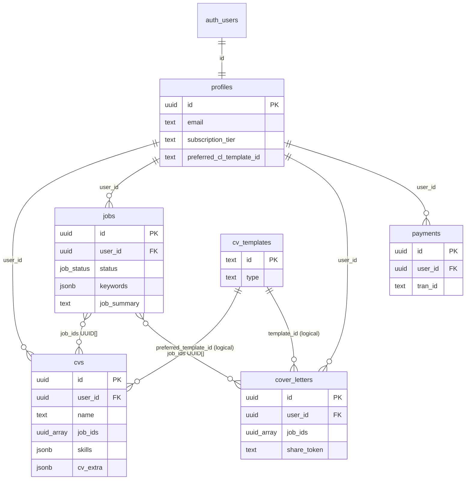

# CareerPulse — Project Feature Summary

CareerPulse is an **AI-powered CV and cover letter platform** for job seekers. Users can build CVs without an account, sign up to save and export, tailor documents to job descriptions with Claude AI, generate cover letters, track applications, and subscribe for higher usage limits.

---

## Table of Contents

1. [Tech Stack](#tech-stack)
2. [Architecture Overview](#architecture-overview)
3. [All Features](#all-features)
4. [Database Schema](#database-schema)
5. [How Tables Connect](#how-tables-connect)
6. [Storage Buckets](#storage-buckets)
7. [App Flows](#app-flows)
8. [Subscription & Feature Gating](#subscription--feature-gating)
9. [API Reference](#api-reference)
10. [Project Structure](#project-structure)

---

## Tech Stack

| Layer | Technology |
|-------|------------|
| **Framework** | Next.js 15 (App Router), React 18 |
| **Language** | TypeScript 5 |
| **Styling** | Tailwind CSS 3, CSS variables (light/dark theme) |
| **Database & Auth** | Supabase (PostgreSQL + Auth via `@supabase/ssr`) |
| **AI** | Anthropic Claude (`@anthropic-ai/sdk`) |
| **State / Data** | Zustand (client), TanStack React Query (server data) |
| **UI / Motion** | Framer Motion, Lucide icons, `@dnd-kit` (drag-and-drop) |
| **Documents** | Puppeteer (PDF), pdf-parse, mammoth (DOCX import), docx (export) |
| **Payments** | SSLCommerz |
| **Email** | Resend |
| **Charts** | Recharts (dashboard tracker chart) |
| **Deploy** | Standalone Node.js output (`output: 'standalone'`) |

---

## Architecture Overview

CareerPulse is a **monolithic Next.js full-stack application**. There is no separate backend service — API logic runs inside Next.js Route Handlers under `app/api/`.

```
┌─────────────────────────────────────────────────────────┐
│                    Next.js Application                   │
│                                                          │
│  ┌──────────────────┐      ┌────────────────────────┐   │
│  │     Frontend     │      │        Backend          │   │
│  │  React pages &   │ ───► │  API Route Handlers     │   │
│  │  components      │      │  (app/api/**/route.ts)  │   │
│  └──────────────────┘      └───────────┬────────────┘   │
│                                         │                 │
└─────────────────────────────────────────┼─────────────────┘
                                          │
                    ┌─────────────────────┼─────────────────────┐
                    ▼                     ▼                     ▼
              Supabase DB          Anthropic Claude        SSLCommerz / Resend
           (PostgreSQL + Auth)      (AI generation)       (payments / email)
```

**Route groups** (parentheses in folder names do not affect URLs):

| Group | Purpose |
|-------|---------|
| `(marketing)` | Public pages: landing, pricing, blog |
| `(auth)` | Login, register, OAuth callback |
| `(dashboard)` | Authenticated app: CV, cover letters, tracker, settings |

**Authentication** is handled by Supabase Auth with SSR cookies. `middleware.ts` protects dashboard routes and redirects unauthenticated users to `/login?returnTo=...`. Guest users can access CV builder paths without an account.

---

## All Features

### 1. Marketing (Public)

| Route | Feature |
|-------|---------|
| `/` | Landing page — hero, how it works, feature grid, template showcase, CTA to guest CV builder |
| `/pricing` | Pricing plans (Pro / Premium / Career, monthly and yearly) |
| `/blog` | Placeholder blog page |

---

### 2. Authentication

| Route | Feature |
|-------|---------|
| `/login` | Email/password, magic link, Google OAuth; supports `returnTo` and guest CV preservation |
| `/register` | Account creation with same redirect and guest-handoff options |
| `/callback` | OAuth callback client page |

**Auth methods:** email/password, magic link, Google OAuth.

**Guest CV handoff:** When a guest builds a CV and then signs up, their in-browser editor state is merged into a saved `cvs` row in Supabase.

**Guest-public paths** (no login required):

- `/cv/builder`
- `/cv/edit`
- `/cv/templates/*`
- `/cv/upload`

---

### 3. Dashboard

| Route | Feature |
|-------|---------|
| `/dashboard` | Greeting, CV completion progress, cover letter usage vs tier limit, tracker status chart, quick links |

**Cross-cutting dashboard features:**

- Onboarding overlay (`OnboardingGate`) for new users (skipped on `/cv/*`)
- Subscription banner and tier-based `FeatureGate`
- Theme toggle (light/dark)
- Page transitions (Framer Motion)

**Sidebar navigation:**

| Nav Item | Routes |
|----------|--------|
| Dashboard | `/dashboard` |
| CV | `/cv`, `/cv/edit`, `/cv/upload`, `/cv/optimise`, `/cv/job-specific` |
| Cover Letters | `/cover-letters`, `/cover-letters/new`, `/cover-letters/templates` |
| Tracker | `/tracker` (Pro+ gated) |
| AI Tools | `/ai-tools` |
| Settings | `/settings`, `/settings/account`, `/settings/billing` |

---

### 4. CV / Resume

#### Pages

| Route | Access | Feature |
|-------|--------|---------|
| `/cv` | Auth | CV dashboard — core versions, job-specific CVs, action cards (upload / build / tailor) |
| `/cv/builder` | Guest + Auth | Redirects to `/cv/edit?guest=true` |
| `/cv/edit` | Guest + Auth | Full CV editor — no account required |
| `/cv/edit/[id]` | Auth | Edit a saved core CV version |
| `/cv/upload` | Guest + Auth | Upload PDF/DOCX → AI extraction |
| `/cv/templates` | Guest + Auth | Browse CV templates |
| `/cv/templates/[templateId]/preview` | Guest + Auth | Template preview |
| `/cv/optimise` | Auth (Pro feature) | 3-step wizard: pick CV → job details → generate CV and/or cover letter |
| `/cv/optimise/result` | Auth | Review/save/export optimised CV + cover letter drafts |
| `/cv/job-specific` | Auth | List job-tailored CVs |
| `/cv/job-specific/[id]/edit` | Auth | Premium job-CV editor with ATS drawer, keywords, live preview |

#### CV Capabilities

- **Structured sections:** personal info, summary, experience, education, skills (with 1–5 ratings), projects, certifications, languages, awards, referrals, publications, research, volunteer, interests, custom sections
- **13 CV templates:** classic, modern, academic, technical, minimal, creative, entry-level, healthcare, amber-strike, midnight-pro, golden-hour, ocean-slate, violet-edge
- **Presentation options:** section visibility toggles, accent color, font family, profile photo upload
- **Live HTML preview** + PDF/PNG export
- **ATS scoring** (Pro+)
- **AI rewrite / polish** modals
- **Multiple core CV versions** per user
- **Job-specific CVs** linked to `jobs` via `job_ids[]`
- **Guest mode:** build, edit, browse templates, and upload without login

---

### 5. Cover Letters

#### Pages

| Route | Feature |
|-------|---------|
| `/cover-letters` | List letters, favourite, delete, ATS badges; free tier capped at 5 visible |
| `/cover-letters/new` | Generate form — job description + tone/length → AI generation |
| `/cover-letters/[id]` | View/edit letter: content, template, header fields, linked job, AI rewrite, export |
| `/cover-letters/[id]/edit` | Dedicated editor with panel + preview + autosave (in progress) |
| `/cover-letters/templates` | Browse/set default cover letter template |

#### Cover Letter Capabilities

- AI generation from job description + user CV
- Tone, length, and emphasis options
- ATS scoring (Pro+)
- 5 templates: classic, modern, formal, minimal, creative
- Template rendering + PDF/DOCX export
- Favourites, naming, job linking
- Public sharing via `share_token`

#### In-Progress (WIP)

- `CoverLetterWizard` — 3-step wizard (source → job details → writing style)
- `CoverLetterEditor` — dedicated editor with panel + preview
- `POST /api/cover-letters/generate` — new wizard API endpoint
- `POST /api/jobs/extract` — scrape job posting URL for metadata

---

### 6. Jobs & Application Tracker

| Route | Feature |
|-------|---------|
| `/tracker` | Kanban-style job board — filter by status, edit job, link CV/cover letter, update status (Pro+ gated) |

**Job statuses** (`job_status` enum):

| Status | Label |
|--------|-------|
| `none` | Not tracked |
| `apply_later` | Apply Later |
| `applied` | Applied |
| `interviewing` | Interviewing |
| `technical_test` | Technical Test |
| `offer_received` | Offer Received |
| `negotiating` | Negotiating |
| `offered` | Offered |
| `rejected` | Rejected |
| `withdrawn` | Withdrawn |
| `ghosted` | Ghosted |

**Privacy design:** Full job descriptions are **never stored** in the database. Only extracted `keywords` and an AI `job_summary` are persisted.

---

### 7. AI Tools

Standalone AI utilities at `/ai-tools` via `POST /api/ai`:

| Tool | Key | Tier Required |
|------|-----|---------------|
| JD Analyser | `jd_analyze` | Free (monthly limit) |
| LinkedIn Summary | `linkedin_summary` | Pro+ |
| Cold Email | `cold_email` | Pro+ |
| Bullet Improver | `bullet_improve` | Pro+ |
| Interview Prep | `interview_questions` | Premium+ |

Also used in the CV editor: `cv_rewrite_suggestions` for AI rewrite/polish modals.

---

### 8. Subscription & Billing

| Route | Feature |
|-------|---------|
| `/settings/billing` | Current plan, upgrade, payment history |
| `/pricing` | Public pricing page |

Payment flow: SSLCommerz checkout → success/fail/cancel callbacks → IPN webhook syncs subscription tier in `profiles`.

---

### 9. Settings

| Route | Feature |
|-------|---------|
| `/settings` | Links to account and billing |
| `/settings/account` | Update name, export all data (JSON), delete account |
| `/settings/billing` | View plans, initiate payment, view payment history |

---

## Database Schema

The schema is versioned in `supabase/migrations/` (18 numbered SQL files, 001–018). The app queries six active tables.

### Schema Evolution

| Era | Tables | Linking Model |
|-----|--------|---------------|
| **001–010** (legacy) | `profiles`, `cv_profiles`, `job_applications`, `job_specific_cvs`, `cover_letters`, `payments`, `cv_templates` | FK: `cover_letters.job_application_id → job_applications` |
| **011–014** (transition) | Added `cvs`, `jobs`; recreated `cover_letters`; added `applied_jobs` join | `cvs.job_ids[]`, `cover_letters.job_ids[]` (no FK) |
| **015–018** (current) | Dropped `applied_jobs`; tracker state on `jobs.status` enum | Soft links via UUID arrays |

Legacy tables (`cv_profiles`, `job_applications`, `job_specific_cvs`, `applied_jobs`) have been superseded and are no longer used by the app.

---

### Table: `profiles`

Extends `auth.users`. Created automatically on signup via `handle_new_user()` trigger.

| Column | Type | Notes |
|--------|------|-------|
| `id` | UUID PK | FK → `auth.users(id)` ON DELETE CASCADE |
| `email` | TEXT NOT NULL | UNIQUE |
| `full_name`, `avatar_url` | TEXT | |
| `subscription_tier` | TEXT | `free`, `pro`, `premium`, `career` |
| `subscription_status` | TEXT | `active`, `inactive`, `cancelled`, `past_due` |
| `subscription_expires_at`, `trial_ends_at` | TIMESTAMPTZ | |
| `is_onboarded` | BOOLEAN | default `false` |
| `preferred_cl_template_id` | TEXT | default `cl-classic` |
| `created_at`, `updated_at` | TIMESTAMPTZ | |

**Supports:** Auth, subscriptions, onboarding, default cover letter template preference.

---

### Table: `cvs`

Unified table for both core CVs and job-specific CVs (replaces `cv_profiles` + `job_specific_cvs`).

| Column Group | Key Columns |
|--------------|-------------|
| Identity | `id` UUID PK, `user_id` FK → profiles, `name` |
| Personal | `full_name`, `professional_title`, `email`, `phone`, `location`, `address`, `photo_url` |
| Links | `linkedin_url`, `github_url`, `links` JSONB |
| Content (JSONB) | `experience`, `education`, `skills`, `projects`, `certifications`, `languages`, `awards`, `referrals` |
| Extended | `section_visibility` JSONB, `cv_extra` JSONB (publications, research, volunteer, interests, custom) |
| Presentation | `preferred_template_id`, `font_family`, `accent_color` |
| Job tailoring | `job_ids` UUID[] — **non-empty = job-specific CV** |
| AI metadata | `ai_changes_summary`, `keywords_added` JSONB, `bullets_improved` |
| Upload | `original_cv_file_url` |
| Status | `is_complete`, `completion_percentage`, `is_archived` |

**Skills shape:** `SkillCategory[]` — `[{id, category, displayOrder, items:[{id, name, rating(1-5)}]}]`

**Supports:** CV builder, multiple versions, job-tailored CVs, AI optimisation metadata, template/export preferences.

---

### Table: `jobs`

Replaces `job_applications`. Holds both saved job postings and tracker state.

| Column | Type | Notes |
|--------|------|-------|
| `id` | UUID PK | |
| `user_id` | UUID FK → profiles | |
| `company_name`, `job_title` | TEXT NOT NULL | |
| `job_url` | TEXT | |
| `job_summary` | TEXT | AI summary for UI only — not sent to generation prompts |
| `keywords` | JSONB | ATS keywords only — full JD never stored |
| `location` | TEXT | |
| `salary_min`, `salary_max` | INTEGER | |
| `salary_currency` | TEXT | default `USD` |
| `work_type` | TEXT | `remote`, `hybrid`, `onsite` |
| `status` | `job_status` ENUM | default `none` |
| Tracker dates | `saved_at`, `applied_at`, `interview_at`, `offer_at`, `deadline` | |
| Meta | `notes`, `contact_name`, `contact_email`, `priority`, `is_starred` | |

**Supports:** Job tracker kanban, job analysis/save, keyword extraction, privacy-conscious storage.

---

### Table: `cover_letters`

| Column | Type | Notes |
|--------|------|-------|
| `id` | UUID PK | |
| `user_id` | UUID FK → profiles | |
| `name` | TEXT | default `Untitled Cover Letter` |
| Generation opts | `tone`, `length`, `specific_emphasis` | |
| Content | `content` TEXT | |
| ATS | `ats_score` (0–100), `ats_keywords_found/missing` JSONB, `ats_summary` | |
| Export | `template_id`, `pdf_url`, `docx_url` | |
| Sharing | `share_token` UNIQUE | enables public read via RLS |
| Meta | `is_favourited`, `generation_model`, `input_tokens`, `output_tokens` | |
| Job link | `job_ids` UUID[] | soft link, no FK |
| Applicant block | `applicant_name/role/email/phone/location` | |

**Supports:** Cover letter generation, ATS scoring, PDF/DOCX export, public share links, job association.

---

### Table: `payments`

| Column | Type | Notes |
|--------|------|-------|
| `id` | UUID PK | |
| `user_id` | UUID FK → profiles | |
| `tran_id` | TEXT UNIQUE | SSLCommerz transaction ID |
| `val_id` | TEXT | |
| `amount` | DECIMAL(10,2) | |
| `currency` | TEXT | default `USD` |
| `status` | TEXT | `pending`, `success`, `failed`, `cancelled`, `refunded` |
| `plan` | TEXT | `pro_monthly`, `pro_yearly`, `premium_monthly`, etc. |
| `billing_period_start/end` | TIMESTAMPTZ | |
| `gateway_response` | JSONB | |

**Supports:** SSLCommerz billing, subscription activation.

---

### Table: `cv_templates`

Static catalog of CV and cover letter templates. No FK from other tables — logical reference only.

| Column | Type | Notes |
|--------|------|-------|
| `id` | TEXT PK | e.g. `classic`, `cl-modern` |
| `type` | TEXT | `cv` or `cover_letter` |
| `name`, `description`, `category` | TEXT | |
| `preview_image_url` | TEXT | |
| `is_premium` | BOOLEAN | |
| `available_tiers` | TEXT[] | subscription gating |
| `sort_order` | INTEGER | |

**CV template IDs:** classic, minimal, sidebar, bold-header, two-column, executive, apex, nova, modern, academic, technical, creative, entry-level, healthcare, amber-strike, midnight-pro, golden-hour, ocean-slate, violet-edge

**Cover letter template IDs:** cl-classic, cl-modern, cl-minimal, cl-formal, cl-creative

---

## How Tables Connect

### Hard Foreign Keys (Postgres constraints)

```
auth.users
    └── profiles (id)                    ON DELETE CASCADE
            ├── cvs (user_id)            ON DELETE CASCADE
            ├── jobs (user_id)           ON DELETE CASCADE
            ├── cover_letters (user_id)  ON DELETE CASCADE
            └── payments (user_id)       ON DELETE CASCADE
```

### Soft Links (no FK — application-enforced)

```
jobs ←── job_ids[] ── cvs
jobs ←── job_ids[] ── cover_letters

cv_templates ←── preferred_template_id (TEXT) ── cvs
cv_templates ←── template_id (TEXT) ── cover_letters
profiles     ←── preferred_cl_template_id (TEXT) ── cv_templates
```

### Entity Relationship Diagram



### How Schema Supports Each Feature

| Feature | Tables / Columns |
|---------|------------------|
| Auth & onboarding | `auth.users` → `profiles` trigger; `is_onboarded` |
| Subscriptions / tiers | `profiles.subscription_*`; `TIER_LIMITS` in TypeScript |
| Payments (SSLCommerz) | `payments`; updates `profiles` tier on success |
| CV builder (core) | `cvs` with JSONB sections; `section_visibility`, `cv_extra` |
| Multiple CV versions | `cvs` — one row per version per user |
| Job-tailored CVs | `cvs` where `job_ids.length > 0` |
| CV upload | `original_cv_file_url` + `cv-uploads` bucket |
| CV photos | `photo_url` + public `cv-photos` bucket |
| CV templates / PDF | `cv_templates`, `preferred_template_id`, `font_family`, `accent_color` |
| Skills with ratings | `cvs.skills` JSONB as `SkillCategory[]` |
| Cover letter generation | `cover_letters` content + tone/length/emphasis |
| Cover letter templates | `cv_templates` where `type = 'cover_letter'` |
| ATS scoring | `cover_letters.ats_*` columns |
| Public CL sharing | `share_token` + permissive SELECT RLS policy |
| Job save / analyze | `jobs` with `keywords`, `job_summary` |
| Job tracker (kanban) | `jobs.status` `job_status` enum + date columns |
| CV/CL ↔ job linking | `job_ids UUID[]` on `cvs` and `cover_letters` |
| Account data export | Settings page reads `cvs`, `cover_letters`, `jobs` for user |

### Row Level Security (RLS)

| Table | Policies |
|-------|----------|
| `profiles` | Users manage own profile — ALL where `auth.uid() = id` |
| `cover_letters` | Users own their cover letters — ALL where `auth.uid() = user_id` |
| `cover_letters` | Public read via share token — SELECT where `share_token IS NOT NULL` |
| `payments` | Users read own payments — SELECT where `auth.uid() = user_id` |
| `cv_templates` | Publicly readable — SELECT for all |
| `storage.objects` | Per-bucket CRUD for authenticated users (own folder) |

> **Note:** Migrations 011+ do not add RLS for `cvs` or `jobs`. The app enforces isolation via `.eq('user_id', user.id)` in API routes, but DB-level RLS may be incomplete for these two core tables.

---

## Storage Buckets

| Bucket | Public | Size Limit | MIME Types | Path Convention | Purpose |
|--------|--------|------------|------------|-----------------|---------|
| `cv-uploads` | No | 10 MB | PDF, DOCX | `{user_id}/...` | Original CV uploads |
| `pdf-exports` | No | — | any | `{user_id}/...` | Generated PDF exports |
| `cv-photos` | Yes | 2 MB | jpeg, png, webp | `{user_id}/...` | Profile photos on CVs |

---

## App Flows

### Flow 1: Guest → Sign Up → Save CV

```
Landing (/) 
  → /cv/builder?guest=true 
  → /cv/edit (CVEditor — no account required)
  → [Want export/AI?] 
  → /register or /login 
  → OAuth or email auth 
  → Guest state hydrated → saved CV in Supabase
```

1. User clicks **"Build my CV — free"** on `/` → redirected to `/cv/edit?guest=true`
2. Edits CV in browser with live preview (no auth required)
3. On export/AI/save → login modal or redirect to `/login?returnTo=...&preserveGuestCv=true`
4. After auth, guest editor state merges into a `cvs` row via `lib/guest-cv-handoff.ts`

---

### Flow 2: Authenticated CV Workflow

```
/dashboard 
  → /cv (CV hub)
  ├── /cv/upload → POST /api/extract → prefilled editor
  ├── /cv/edit or /cv/edit/[id] (manual edit)
  └── /cv/optimise (Tailor for Job — 3 steps)
        → POST /api/cv/optimise
        → /cv/optimise/result (review draft)
        → POST /api/cvs/save-optimised (persist)
        → /cv/job-specific/[id]/edit (optional premium editor)
```

1. **Onboarding overlay** guides upload or manual edit (skipped on `/cv/*`)
2. **Upload path:** `/cv/upload` → AI extracts content from PDF/DOCX → prefilled editor
3. **Manual path:** `/cv/edit` or pick a version from `/cv`
4. **Tailor path:** `/cv/optimise` → analyse JD → generate → review → save job CV and/or cover letter

---

### Flow 3: Cover Letter Workflow

```
/cover-letters 
  → /cover-letters/new 
  → POST /api/cv/optimise (generationType=coverLetter)
  → /cover-letters/[id] (view/edit)
  → POST /api/export (type=cover_letter)
```

1. List at `/cover-letters` → click **New**
2. Enter job description, company, title, tone, length → AI generates letter
3. Optional ATS score via `/api/cover-letter/score-ats` (Pro+)
4. Edit on `/cover-letters/[id]` (or new `/cover-letters/[id]/edit` editor)
5. Export as PDF/DOCX

**Planned wizard flow (WIP):**

```
/cover-letters/new 
  → CoverLetterWizard (3 steps: source → job details → writing style)
  → POST /api/cover-letters/generate
  → /cover-letters/[id]/edit
```

---

### Flow 4: Sign Up / Login

```
/register or /login
  → email/password | magic link | Google OAuth
  → /callback or /api/auth/[...supabase]
  → redirect to /dashboard (or returnTo path)
```

- Logged-in users hitting auth routes → redirect to `/dashboard`
- Protected routes without session → `/login?returnTo=<path>`

---

### Flow 5: Job Tracking

```
Job created via:
  ├── /cv/optimise flow → POST /api/jobs/save
  └── Tracker UI → POST /api/jobs

/tracker (Pro+)
  → filter by status
  → PATCH /api/jobs/[id]/status
  → open linked CV or cover letter
```

---

### Flow 6: Upgrade / Billing

```
/pricing or in-app UpgradeCTA
  → /settings/billing
  → select plan
  → POST /api/payment/initiate
  → SSLCommerz checkout
  → /api/payment/success | fail | cancel
  → POST /api/payment/ipn (webhook)
  → profiles.subscription_tier updated
```

---

### Flow 7: CV Optimise (Tailor for Job)

```
/cv/optimise
  Step 1: Select core CV version
  Step 2: Enter job URL or paste job description
          → POST /api/jobs/analyze (optional)
          → POST /api/jobs/extract (if URL provided)
  Step 3: Choose generation type (CV / cover letter / both)
          → POST /api/cv/optimise
  → /cv/optimise/result (review AI output in draft store)
  → Save CV → POST /api/cvs/save-optimised
  → Save cover letter → POST /api/cover-letters
  → Track job → POST /api/jobs/save
```

---

## Subscription & Feature Gating

### Tiers

| Tier | Generations/mo | CV Uploads | Tracker | ATS | AI Extras |
|------|----------------|------------|---------|-----|-----------|
| **Free** | 3 | 1 | No | No | No |
| **Pro** | 30 | Unlimited | Yes | Yes | Yes |
| **Premium** | 100 | Unlimited | Yes | Yes | Yes |
| **Career** | Unlimited | Unlimited | Yes | Yes | Yes |

### Pricing

| Plan | Amount | Period |
|------|--------|--------|
| Pro Monthly | $9.99 | 30 days |
| Pro Yearly | $89.99 | 365 days |
| Premium Monthly | $19.99 | 30 days |
| Premium Yearly | $179.99 | 365 days |
| Career Monthly | $29.99 | 30 days |
| Career Yearly | $269.99 | 365 days |

Gating is enforced in:

- `lib/subscription.ts` — server-side tier checks and generation quotas
- `components/shared/FeatureGate.tsx` — UI-level tier gating
- API routes — generation limit checks before Claude calls

---

## API Reference

### Auth

| Endpoint | Methods | Purpose |
|----------|---------|---------|
| `/api/auth/[...supabase]` | GET | Supabase auth callback handler |
| `/api/auth/signout` | POST | Sign out |

### CV

| Endpoint | Methods | Purpose |
|----------|---------|---------|
| `/api/cv` | GET, PATCH | Primary CV profile |
| `/api/cvs` | GET, POST | List/create CV records |
| `/api/cvs/[id]` | GET, PATCH, DELETE | Single CV CRUD |
| `/api/cvs/save-optimised` | POST | Persist optimised/tailored CV from draft |
| `/api/cv/versions` | GET | Core CV versions |
| `/api/cv/versions/[id]` | DELETE | Delete core version |
| `/api/cv/job-specific` | GET, POST | Job-specific CVs |
| `/api/cv/job-specific/[id]` | GET, PATCH, DELETE | Single job CV |
| `/api/cv/optimise` | POST | AI tailor CV and/or generate cover letter |
| `/api/cv/preview-html` | GET, POST | Render CV HTML preview |
| `/api/cv/preview-png` | POST | CV preview as PNG |
| `/api/extract` | POST | Parse uploaded PDF/DOCX with Claude |
| `/api/export` | POST | Export CV or cover letter as PDF/DOCX |

### Cover Letters

| Endpoint | Methods | Purpose |
|----------|---------|---------|
| `/api/cover-letters` | GET, POST | List/create cover letters |
| `/api/cover-letters/[id]` | PATCH, DELETE | Update/delete letter |
| `/api/cover-letters/generate` | POST | Generate from CV or manual content + job context (WIP) |
| `/api/cover-letter/preview-html` | GET, POST | HTML preview |
| `/api/cover-letter/score-ats` | POST | ATS score for letter vs JD |
| `/api/generate` | POST | Streaming cover letter generation (legacy) |

### Jobs

| Endpoint | Methods | Purpose |
|----------|---------|---------|
| `/api/jobs` | GET, POST | List/create jobs |
| `/api/jobs/[id]` | GET, PATCH, DELETE | Single job CRUD |
| `/api/jobs/[id]/status` | PATCH | Update tracker status |
| `/api/jobs/save` | POST | Save job from optimise flow |
| `/api/jobs/analyze` | POST | AI job description analysis |
| `/api/jobs/extract` | POST | Scrape job posting URL for metadata (WIP) |

### AI Tools

| Endpoint | Methods | Purpose |
|----------|---------|---------|
| `/api/ai` | POST | Standalone AI tools (JD analyser, LinkedIn summary, etc.) |

### Subscription & Payments

| Endpoint | Methods | Purpose |
|----------|---------|---------|
| `/api/subscription` | GET | Subscription state |
| `/api/payment/initiate` | POST | Start SSLCommerz checkout |
| `/api/payment/success` | GET, POST | Payment success callback |
| `/api/payment/fail` | GET, POST | Payment failure callback |
| `/api/payment/cancel` | GET, POST | Payment cancel callback |
| `/api/payment/ipn` | POST | SSLCommerz IPN webhook |

---

## Project Structure

```
CareerPulse_WEB/
├── app/
│   ├── (marketing)/          # Public: /, /pricing, /blog
│   ├── (auth)/               # /login, /register, /callback
│   ├── (dashboard)/          # All authenticated app pages
│   │   ├── dashboard/
│   │   ├── cv/               # CV hub, editor, upload, optimise, job-specific
│   │   ├── cover-letters/    # List, new, view, edit, templates
│   │   ├── tracker/          # Job application board
│   │   ├── ai-tools/         # Standalone AI utilities
│   │   └── settings/         # Account, billing
│   └── api/                  # 34+ REST API route handlers
├── components/
│   ├── auth/                 # AuthGuard, AuthHeroPanel, SignOutButton
│   ├── cover-letter/         # Wizard, editor, GenerateCoverLetterForm, preview
│   ├── cv/                   # Editor, dashboard, optimise steps, premium job editor
│   ├── dashboard/            # TrackerStatusChart
│   ├── marketing/            # Landing header, template grid
│   ├── onboarding/           # OnboardingGate
│   ├── providers/            # AppProviders, AuthProvider, QueryProvider, ThemeProvider
│   ├── shared/               # AppHeader, FeatureGate, PageHeader, ATSBadge
│   ├── tracker/              # TrackerBoard
│   └── ui/                   # button, card, input, modal, tabs, toast
├── hooks/                    # useCV, useCoverLetters, useTracker, useSubscription
├── stores/                   # useAuthStore, guestCvStore, optimise draft stores
├── lib/
│   ├── claude.ts             # All Claude AI calls
│   ├── supabase/             # client, server, public-env
│   ├── queries/              # cvs, cover-letters, jobs query helpers
│   ├── cv-*.ts               # parsing, mapping, completion, ATS, diff, export
│   ├── cover-letter-html.ts
│   ├── pdf.ts                # PDF generation orchestration
│   ├── subscription.ts       # Tier checks, generation limits
│   ├── sslcommerz.ts         # Payment integration
│   ├── guest-cv-*.ts         # Guest path + OAuth handoff
│   └── rate-limit.ts
├── types/
│   ├── index.ts              # Domain types, TIER_LIMITS, PRICING, JOB_STATUS_CONFIG
│   ├── database.ts           # Supabase table shapes
│   └── cover-letter.ts       # Wizard/editor types (WIP)
├── src/
│   ├── config/templateConfig.ts   # CV template metadata
│   ├── templates/                 # HTML/CSS CV templates
│   ├── services/pdfRenderer.ts    # Puppeteer PDF
│   └── types/cv.types.ts          # CVData, TemplateId, SkillCategory
├── templates/                # Legacy HTML templates (cv/*.html, cover-letter/*.html)
├── supabase/migrations/      # 18 SQL migrations
└── middleware.ts             # Supabase session + route protection
```

---

## Key Design Decisions

1. **Privacy-first job storage:** Full job descriptions are never persisted — only extracted `keywords` and an AI `job_summary`.
2. **Flexible CV data:** Heavy use of JSONB for CV sections keeps the schema stable while the editor evolves.
3. **Unified CV table:** Core and job-specific CVs share one `cvs` table, distinguished by whether `job_ids` is empty or not.
4. **Soft job linking:** `job_ids UUID[]` on `cvs` and `cover_letters` allows flexible many-to-many-style links without FK cascade complexity.
5. **Guest-first CV building:** Users can build a full CV without signing up, lowering the barrier to entry.
6. **Monolithic architecture:** Single Next.js app handles frontend, API, and document processing — no separate backend service.
7. **Template catalog:** Text PK in `cv_templates` with tier gating via `available_tiers` array.

---

*Generated from codebase analysis — migrations 001–018, types, routes, and components.*
